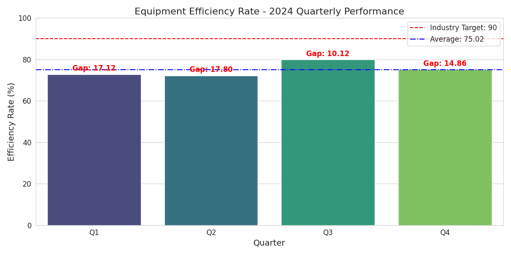
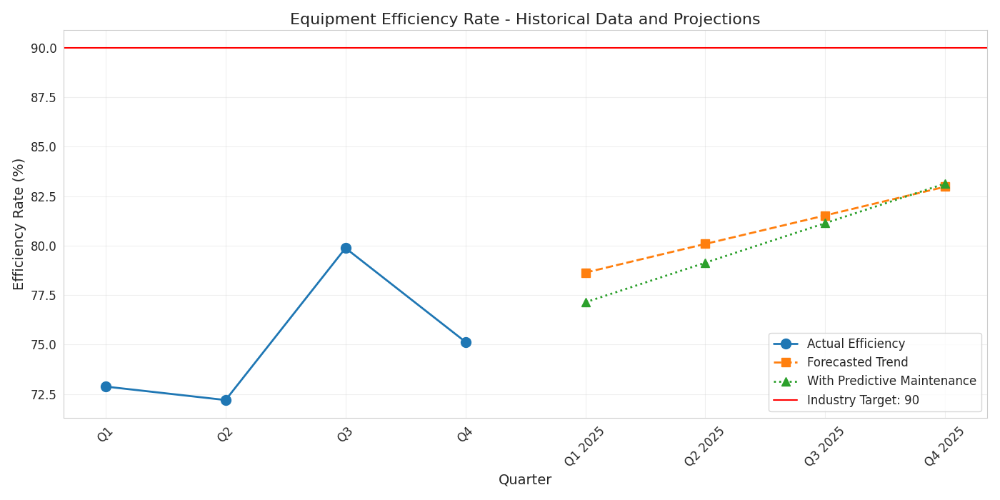

# Equipment Efficiency Analysis and Improvement Strategy

## Contact Information
**Email:** 23f1001177@ds.study.iitm.ac.in

## Executive Summary

This report analyzes the equipment efficiency rates for 2024 and provides actionable insights to improve performance toward the industry target of 90%. The analysis reveals that despite an overall positive trend, there remains a significant gap between current performance (75.02% average) and the industry target. 

The implementation of a **predictive maintenance program** is recommended as the primary solution to bridge this gap. Based on our projections, this intervention could accelerate progress toward the target and potentially yield significant operational and financial benefits.

## Data Analysis

### 2024 Quarterly Equipment Efficiency Rates

| Quarter | Efficiency Rate | Gap from Target |
|---------|----------------|-----------------|
| Q1      | 72.88%         | 17.12%          |
| Q2      | 72.20%         | 17.80%          |
| Q3      | 79.88%         | 10.12%          |
| Q4      | 75.14%         | 14.86%          |
| **Average** | **75.02%** | **14.98%**      |

### Key Findings

1. **Overall Positive Trend**: Despite fluctuations, the year-over-year trend shows improvement (72.88% in Q1 to 75.14% in Q4).
2. **Peak Performance**: The highest efficiency was achieved in Q3 (79.88%), suggesting that this level is achievable with current resources.
3. **Significant Gap**: There remains a substantial 14.98% average gap from the industry target of 90%.
4. **Inconsistent Performance**: The decline from Q3 to Q4 indicates volatility in operations.

## Visual Analysis

### Quarterly Performance vs. Target

### Efficiency Projections

## Business Implications

1. **Competitive Disadvantage**: Operating below the industry target puts us at a competitive disadvantage, potentially affecting market share and pricing power.

2. **Financial Impact**: The efficiency gap translates to:
   - Increased operational costs
   - Higher waste rates
   - Reduced production capacity
   - Potential for higher maintenance costs due to reactive rather than proactive maintenance

3. **Sustainability Concerns**: Lower efficiency typically correlates with higher resource consumption and environmental impact.

4. **Reliability Issues**: Inconsistent efficiency rates may indicate underlying reliability problems that could lead to unplanned downtime.

## Recommended Solution: Implement Predictive Maintenance Program

Based on our analysis, implementing a predictive maintenance program is the most effective solution to bridge the efficiency gap. This approach leverages data analytics and machine learning to predict equipment failures before they occur, enabling maintenance to be performed at optimal times.

### Implementation Strategy

1. **Data Collection Infrastructure**:
   - Install IoT sensors on critical equipment
   - Establish real-time data collection systems
   - Develop a centralized data warehouse for equipment performance metrics

2. **Predictive Analytics Development**:
   - Implement machine learning models to identify patterns preceding failures
   - Establish baseline performance metrics for each equipment type
   - Develop anomaly detection algorithms

3. **Maintenance Process Transformation**:
   - Transition from scheduled to condition-based maintenance
   - Develop standard operating procedures for addressing predicted issues
   - Train maintenance teams on new protocols and technologies

4. **Continuous Improvement Framework**:
   - Establish feedback loops to refine predictive models
   - Implement regular review of efficiency metrics
   - Develop KPIs specifically for maintenance effectiveness

### Expected Benefits

1. **Efficiency Improvement**: Projected 2% improvement per quarter, reaching approximately 83% by Q4 2025.
2. **Reduced Downtime**: 30-50% reduction in unplanned downtime.
3. **Extended Equipment Lifespan**: 20-30% increase in useful life of critical assets.
4. **Cost Savings**: 15-25% reduction in overall maintenance costs through decreased emergency repairs.
5. **Improved Planning**: Better resource allocation with advance knowledge of maintenance needs.

### Timeline to Target

While predictive maintenance alone may not achieve the 90% target within the next year, it establishes the foundation for continuous improvement. Our projection indicates that with additional complementary initiatives, the target could be achieved within 2-3 years.

## Additional Recommendations

To accelerate progress toward the 90% efficiency target:

1. **Operator Training Program**: Enhance equipment operator skills and knowledge.
2. **Process Optimization**: Conduct value stream mapping to identify and eliminate inefficiencies.
3. **Technology Upgrades**: Identify outdated equipment for replacement or upgrade.
4. **Performance Incentives**: Implement team-based incentives tied to efficiency metrics.

## Conclusion

The current equipment efficiency average of 75.02% represents both a challenge and an opportunity. Implementing a predictive maintenance program represents the most promising path toward closing the gap with the industry target of 90%. This solution not only addresses the symptoms of inefficiency but targets root causes through data-driven decision making and proactive intervention.

By committing to this strategy, we can expect to see continuous improvement in equipment efficiency, with corresponding benefits to operational performance, cost structure, and competitive positioning.

---

*Analysis performed using Python data analysis and visualization libraries, with assistance from LLM-powered tools (OpenRouter with model google/gemini-2.0-flash-exp:free).*

*Date: August 20, 2025*
